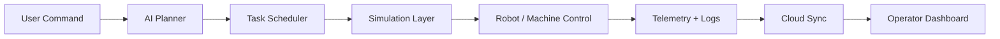

<!-- GitHub Profile README for kazuha-alice -->
<!-- Save this as README.md inside a repo named exactly: kazuha-alice -->

<div align="center">

# Hi, I'm Shiwam Shorya Sharma 👋

### Mechatronics Engineer • Autonomous Systems Builder • Digital Twin Developer


</div>


## 🚀 About Me

I build **autonomous systems**, **digital twin factories**, and **AI-driven industrial workflows** that connect simulation, robotics, cloud, and real-time dashboards.

My work focuses on turning complex factory logic into practical systems:

- 🤖 **Robotics & Automation:** ROS 2, MoveIt2, robot motion flow, AMR logic, machine-level control
- 🏭 **Digital Twin:** NVIDIA Isaac Sim / Isaac Lab, USD workflows, factory simulation, WebRTC streaming
- 🧠 **AI Scheduling:** LLM-assisted planning, task routing, GA/PPO/ACO/PSO-style scheduling concepts
- ☁️ **Cloud + Edge:** AWS, WebSocket APIs, S3 sync, Lambda, edge execution pipelines
- 💻 **Full Stack:** React, JavaScript, TypeScript, Flask, dashboards, admin panels, telemetry UI
- 📊 **Data & ML:** Python, Pandas, Scikit-learn, NLP, sentiment analysis, prediction systems

> **Method:** Build → Simulate → Measure → Debug → Deploy → Improve.

---

## 🧠 Engineering Method

I do not only build UI screens. I design the complete execution layer behind them.

| Layer | What I Focus On |
|---|---|
| **Planning** | Convert high-level goals into executable task sequences |
| **Simulation** | Validate robot, CNC, 3D printer, and AMR behavior before real execution |
| **Control** | Motion flow, service/action calls, state machines, and error recovery |
| **Telemetry** | Live robot status, Modbus data, logs, latency, task progress, and debugging views |
| **Cloud Sync** | Edge-to-cloud data movement using WebSocket, REST, S3, Lambda, and database layers |
| **Dashboard** | Clean operator UI for monitoring, execution, history, and admin-level visibility |

---

## 🛠️ Tech Stack

<div align="center">


</div>

### Core Knowledge Areas

```txt
Robotics        : ROS 2, MoveIt2, URDF, TF, Joint Trajectories, AMR logic
Simulation      : NVIDIA Isaac Sim, Isaac Lab, USD, WebRTC Streaming, Digital Twin
AI / ML         : Python, Pandas, NumPy, Scikit-learn, NLP, Sentiment Analysis
Cloud / Edge    : AWS, API Gateway, Lambda, S3, EC2, WebSocket, REST APIs
Frontend        : React, Vite, JavaScript, TypeScript, HTML, CSS, Admin Dashboards
Backend         : Flask, FastAPI concepts, MySQL, SQLite, API design
3D / Design     : Blender, CAD-style workflows, Unreal Engine, Unity
Systems         : Linux, Windows, WSL2, Docker, PowerShell, Bash, Git
```

---

## 🏭 Current Focus

```yaml
project_direction: Autonomous Factory + Digital Twin
simulation: NVIDIA Isaac Sim / Isaac Lab
robotics: ROS 2 + MoveIt2 + industrial robot workflows
cloud: AWS WebSocket + S3 + Lambda + EC2
frontend: React/Vite dashboard for operators and admins
ai_layer: LLM-assisted task planning and execution routing
```

I am working on systems where a user can submit a factory-level command and the system can:

1. Understand the task intent  
2. Plan the execution sequence  
3. Assign machines and robots  
4. Simulate or execute the workflow  
5. Stream live status to the dashboard  
6. Store logs, task history, and analytics  

---

## 📌 Featured Projects

### 🔹 [Cloud-Enabled-Digital-Twin](https://github.com/kazuha-alice/Cloud-Enabled-Digital-Twin)
Digital Twin Autonomous Factory test build with cloud-enabled execution logic, machine flow, and dashboard concepts.

**Focus:** Digital Twin • Factory Automation • Cloud Sync • JavaScript • Simulation UI

---

### 🔹 [URDF-BUILDER-2.0](https://github.com/kazuha-alice/URDF-BUILDER-2.0)
Visual URDF robot builder for ROS, Gazebo, and NVIDIA Isaac Sim. Designed for creating mobile robots, manipulators, sensors, and controllers with validation and export logic.

**Focus:** ROS • URDF • Isaac Sim • Robot Modeling • TypeScript

---

### 🔹 [ML_NLP_RestaurantReview_Python](https://github.com/kazuha-alice/ML_NLP_RestaurantReview_Python)
Machine learning and NLP project for restaurant review analysis.

**Focus:** Python • NLP • Machine Learning • Text Classification

---

### 🔹 [WeatherAPP](https://github.com/kazuha-alice/WeatherAPP)
Weather application project using Python / Flutter-style app concepts.

**Focus:** App Development • Python • UI Logic

---

## ⚙️ System Design Mindset



I prefer **modular architecture** over one large script.  
A proper system should have separated layers for planning, execution, monitoring, logs, recovery, and UI.

---

## 📊 GitHub Stats

<div align="center">


</div>

---

## 🧩 What I Like Building

- Autonomous factory dashboards
- ROS 2 and robot-control workflows
- Isaac Sim digital twin scenes
- Cloud-to-edge industrial pipelines
- AI-assisted task planning systems
- ML/NLP analysis projects
- Admin dashboards and monitoring panels
- Developer tools that reduce repetitive engineering work

---

## 🌐 Connect

<div align="center">

[](https://www.linkedin.com/in/shiwam-shorya-sharma-b60b691b7/)
[](https://x.com/QuantumShiwam)
[](https://github.com/kazuha-alice)

</div>

---

<div align="center">

### ⚡ Build systems that move, think, measure, and improve.


</div>


---
.... STILL UPDATING ....
